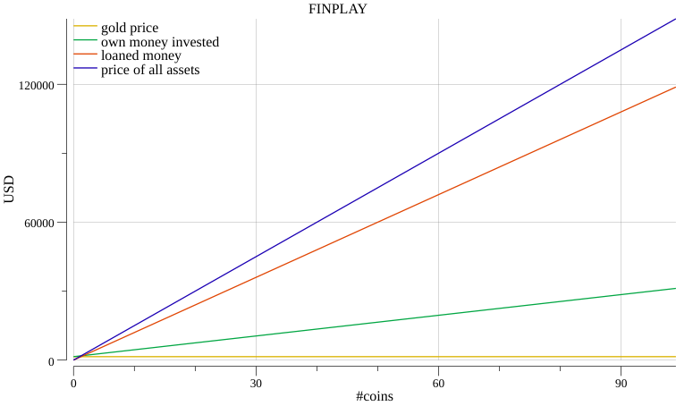
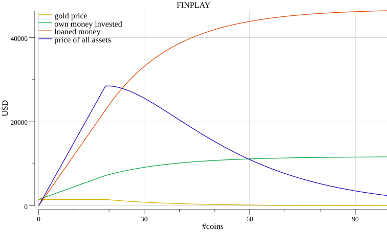
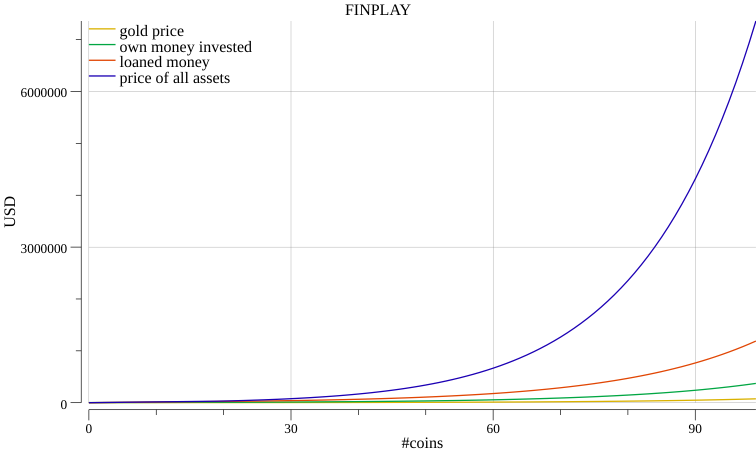
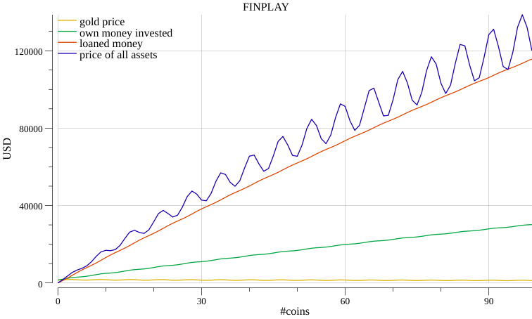
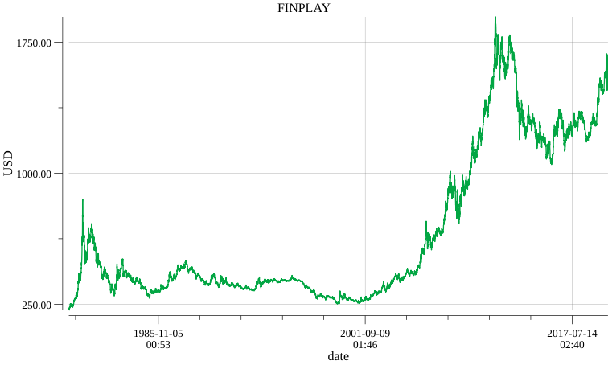

Technical readme is [here](CONTRIBUTING.md)

# Why finplay?

I was overhelmed by thinking through all possible scenarios of using [gold as colletaral](https://www.sunshineprofits.com/gold-silver/dictionary/gold-collateral/) in investments and decided to learn a bit of Go.

# Scenarios
My first ideas where using plotting libraries to answer the questions I had:
What happens when I buy more and more coins and: 
- the price stays the same 

- the price sinks after a while

- the price increased after a while

- the price is realistic (whatever that means)


## TODO:
- find and plot historical gold price :heavy_check_mark:

- use historical gold price data to create scenarios based on real data 

# How ?
I assume some random gold price and just buy 100 coins in equal intervals.
The 'bank' is super generous and gives me a loan for each, already owned, gold coin of 80% to buy the next one!
```go
const (
	goldPrice               = 1500.0 // dollar
	colletralizedPercentage = 80.0
	rebuys                  = 100 // times you'll rebuy another gold coin
)

func goldPlay(goldMod goldPriceModifier) (plotter.XYs, plotter.XYs, plotter.XYs, plotter.XYs) {

	goldValues := make(plotter.XYs, rebuys)
	ownMoneyInvested := make(plotter.XYs, rebuys)
	loanedMoney := make(plotter.XYs, rebuys)
	priceOfAssets := make(plotter.XYs, rebuys)

	currentGoldPrice := goldPrice
	previousGoldPrice := goldPrice
```
I keep track of gold price, total money invested, total bank loans and asset price based on the price at the time of buying. 

`currentGoldPrice` is adjusted based on the modifier function that is passed to `goldPlay(fn)` 
```go
currentGoldPrice = goldMod(i, currentGoldPrice)
```
The scenarios above are all variations of goldPlay with different modifiers.
See the [here](finplay.go#L59)
